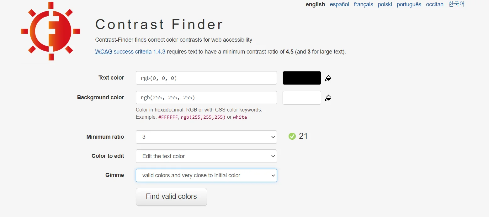
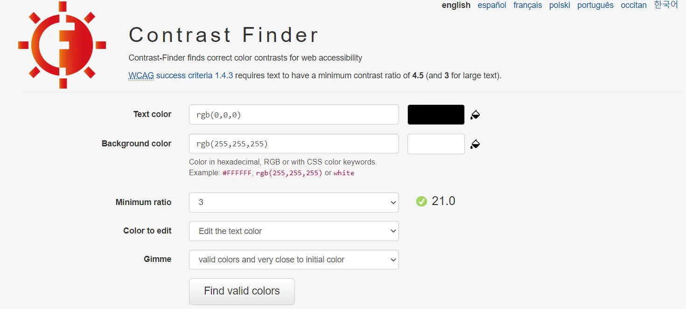

# Subasta Total
Subasta o también conocido como Subasta total es una aplicación web donde todas tus pujas solamente se ven influidas por fondos viruales (sin dinero físico o criptomonedas). Es totalmente virtual, no se dejen engañar y pujen ahora que la cuenta atrás acaba pronto.

## Tecnologías
| Frontend |
|----------|
|        |
| And JS Libraries |

| Backend |
|---------|
|        |

| Others |
|--------|
|      |

## Modelado

## Ruta de páginas

## Despliegue de aplciaciones web
Buscando un proveedor de hosting

## Diseño de interfaces
| Color dominante: naranja |
|--------------------------|
| La impulsividad de los compradores para conseguir los productos que hay en oferta. Las reacciones de los pujadores y color dominante (naranja) son los facotres que forman esta gran combinación. Lo más llamativo de cada subasta celebrada será el ganador/a, la cantidad de pujas, y el último valor para el producto. |

Paleta de colores: complementaria

Fuente del prototipo: Open Sans

Open Sans es una fuente sans-serif y este tipo de fuente mejora la legibilidad en todos los tipos de 
dispositivos y facilita la lectura a las personas con dificultades de vision.

Fuente acompañante: Noto Sans

Esta fuente también termina en Sans y es sans-serif. Su unión no sería un problema.

Contrast finder

Equilibrio visual y tensión compositiva.

- Equilibrio informal: deja la idea simetría, dependiendo del objeto visualizado, este puede tener un gran valor y viceversa. Se basa en asimetría intencionada. Unas tienen menor peso que las grandes.
- Forma regular = aumento de peso (valor)
- Colores luminosos e intensos tienen mayor valor
- El equilibrio depende de su posición
- Técnica sugestiva: trata de llamar la atención del usuario, utilizando puntos de apoyo

Prototipo 1920x1080 (portátil): [Prototipo](https://www.figma.com/proto/MGazLbzsWFdFpbrXs1uyWc/Prototipo-subasta-(DESKTOP)?node-id=1%3A5&scaling=min-zoom&page-id=0%3A1&starting-point-node-id=1%3A5)

Enlance de prototipo 360x640 (móvil): [Prototipo](https://www.figma.com/proto/WEoUJsjENQh8x2WGeOYmgg/Prototipo-subasta-(PHONE)?node-id=4%3A3&scaling=min-zoom&page-id=0%3A1&starting-point-node-id=1%3A5)

## Horas de libre configuración
Bucar la forma más eficiente de traducir las páginas del proyecto (Mínimo: inglés o español)

## Bibilografía
Enlaces de interés:
-------------------

- https://geekflare.com/es/online-auction-software/

- https://geekflare.com/online-auction-software/

- https://geekflare.com/es/online-auction-software/

- https://github.com/Queky/ErMercailloH

- https://github.com/cam-ila/subastayar

- https://github.com/farolfo/subasta-ya

- https://github.com/Khalid145/WebAuction

- https://github.com/topics/auction-website

- https://github.com/shrestsav/auction

- https://github.com/functionfirst/realtime-auction

- https://github.com/bids-standard/bids-examples

- https://github.com/CodingImproveLife/laravel-auction

- https://www.elmueble.com/decoracion/muebles-transformables-y-convertibles-perfectos-para-ahorrar-espacio-y-ganar-estilo-con-shopping_47675

- https://www.ikea.com/es/es/ideas/7-muebles-transformables-y-multifuncion-para-espacios-pequenos-pub254a6490

- https://www.businessinsider.es/6-muebles-convertibles-ikea-te-van-solucionar-vida-1004871

- https://play.google.com/store/apps/details?id=com.catawiki2&hl=es&gl=US

- https://play.google.com/store/apps/details?id=net.sharewire.subastadeocio&hl=es&gl=US

- https://hackernoon.com/metamorphosis-morphing-svgs-378cf4f3aa58

- https://www.freshconsulting.com/insights/blog/8-methods-of-ux-analysis/

- https://subastonic.com/

- https://andro4all.com/aplicaciones/mejores-aplicaciones-de-subastas-para-android

- https://www.getapp.es/directory/185/auction/software

- https://www.daniloaz.com/es/aplicacion-web-subastas-coches-online-presenciales/

- https://regispro.es/jose-maria-de-pablos-la-informacion-registral-en-el-marco-de-las-subastas-electronicas/

- https://vertabelo.com/blog/an-online-auction-data-model/

- https://relevant.software/blog/how-to-build-bidding-website/

- https://stackoverflow.com/questions/7455365/database-design-for-an-auction-style-website

- https://www.getapp.es/directory/185/auction/software

- https://www.frozenmountain.com/developers/blog/archive/build-an-auction-website-with-websync/

- https://www.youtube.com/watch?v=bZHGni95gLY

- https://vertabelo.com/blog/defining-identifying-and-non-identifying-relationships-in-vertabelo/#:~:text=Identifying%20relationships%20exist%20when%20the,the%20child%20entity's%20primary%20key.

- https://codecanyon.net/item/auctglobal-live-auction-laravel-script/22316909

- https://www.codester.com/items/4105/php-laravel-auction-multi-vendor-auction-script

- https://www.youtube.com/watch?v=WTiBT4zb420

- https://nullpress.net/free-download-larabid-a-laravel-php-auction-platform/

- https://codecanyon.net/item/larabid-a-laravel-php-auction-platform/21221158

- https://codecanyon.net/category/php-scripts?tags=laravel&term=bidding

- https://laravel.io/forum/06-12-2015-how-to-plan-for-a-auction-site-in-laravel

- https://laracasts.com/discuss/channels/laravel/how-would-you-structure-a-winning-bid

- https://kornatzky.medium.com/real-time-auctions-with-laravel-638e404637a4

- https://webkul.com/blog/laravel-ecommerce-multi-vendor-auction/

- https://1library.co/article/problema-subastas-aplicaciones-programaci%C3%B3n-declarativa.q0p9rjlz

- https://www.researchgate.net/figure/Funcionamiento-del-algoritmo-de-subasta-de-aceptacion-diferida_fig1_339032231

- https://es.linkedin.com/pulse/algoritmia-vs-puja-fija-en-las-subastas-de-compra-medios-vinagre

- https://www.idealista.com/
