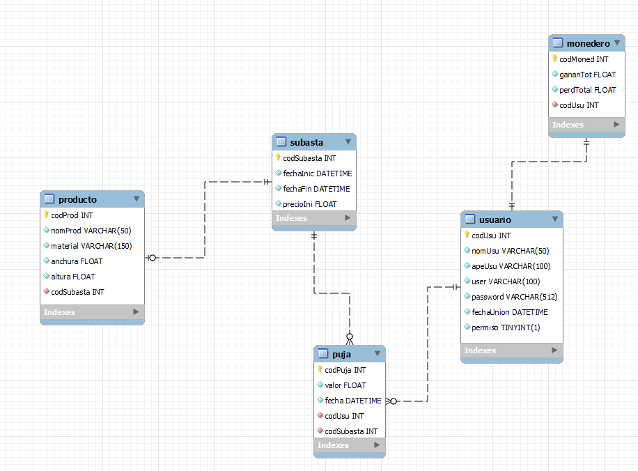
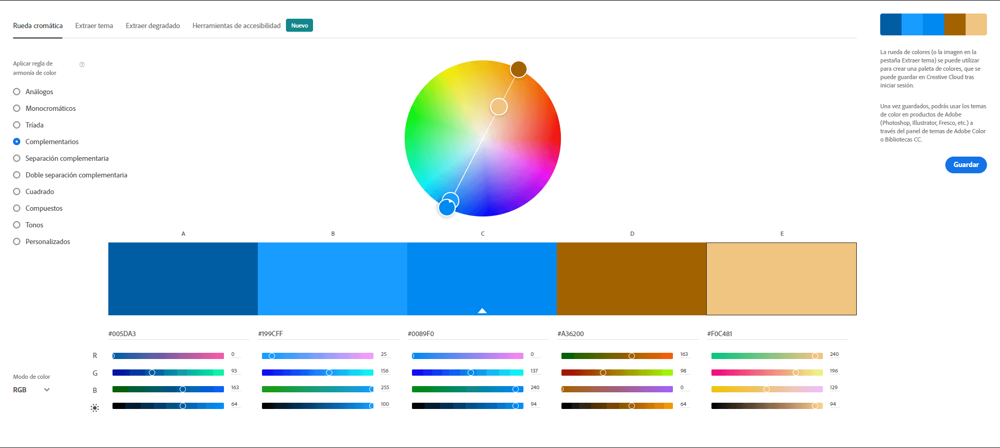

# Subasta Total
Subasta o también conocido como Subasta total es una aplicación web donde todas tus pujas solamente se ven influidas por fondos viruales (sin dinero físico o criptomonedas). Es totalmente virtual, no se dejen engañar y pujen ahora que la cuenta atrás acaba pronto.

## Home

## Modelado

## Desarrollo en Entorno cliente

## Desarrollo en Entorno servidor

## Despliegue de aplciaciones web
Buscando un proveedor de hosting

## Diseño de interfaces
Figma: [Prototipo](https://www.figma.com/proto/MGazLbzsWFdFpbrXs1uyWc/Prototipo-subasta?node-id=1%3A5&starting-point-node-id=1%3A5)

| Color dominante: naranja |
|---------|
| La impulsividad de los compradores para conseguir los productos que hay en oferta. Las reacciones de los pujadores y color dominante (naranja) son los facotres que forman esta gran combinación. Lo más llamativo de cada subasta celebrada será el ganador/a, la cantidad de pujas, y el último valor para el producto. |

Paleta de colores: complementaria

Fuente del prototipo: ??

¿Por qué?

Fuente acompañante: ??

¿Por qué?

Contrast finder

imagen

Equilibrio visual y tensión compositiva.

¿Motivos?

Enlance de prototipo 1920x1080 (portátil)

Enlance de prototipo 360x640 (móvil)

## Horas de libre configuración
Bucar la forma más eficiente de traducir las páginas del proyecto (Mínimo: inglés o español)

## Bibilografía
