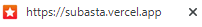

# Subasta Total
Subasta total es una aplicación web donde se puja solamente con monedas de prueba.<br/>
No se acepta dinero real ya sea físico o criptomonedas<br/>
Es totalmente virtual, no se dejen engañar y pujen ahora que la cuenta atrás acaba pronto.


## Comandos
Download repository

```bash
git clone https://github.com/githubDaw1/subasta.git
```

Download and install dependencies

```bash
composer install && npm install
```

Upgrade dependencies

```bash
composer update && npm audit && ncu && ncu -u
```

Deploy local
```bash
php artisan serve
```


## Tecnologías
| Frontend |
|----------|
| [](https://www.w3.org/html/)  [](https://www.w3schools.com/css/)  [](https://developer.mozilla.org/en-US/docs/Web/JavaScript)  [](https://sass-lang.com) |
| And JS Libraries |

| Backend |
|---------|
| [](https://www.php.net)  [](https://www.mysql.com/)  [](https://laravel.com/)  [](https://nodejs.org/es/) |

Framework: Laravel 8<br/>
Lenguaje: PHP 8.0<br/>
Verión de Mysql establecida por el servidor<br/>
Verión de Nodejs: versiones recientes (las últimas versiones)

| Others |
|--------|
| [](https://www.figma.com/)  [](https://git-scm.com/)  [](https://github.com/) |


## Modelado


## Ruta de páginas


## Hosting
| Hosting |
|---------|
| [](https://railway.app/)  [](https://vercel.com/)  |


Problemas en los despliegues

[](https://subasta-production.up.railway.app/)

[](https://subasta.vercel.app/)


## Combinación de colores y fuente
| Color dominante: naranja |
|--------------------------|
| La impulsividad de los compradores para conseguir los productos que hay en oferta. Las reacciones de los pujadores y color dominante (naranja) son los facotres que forman esta gran combinación. Lo más llamativo de cada subasta celebrada será el ganador/a, la cantidad de pujas, y el último valor para el producto. |

Paleta de colores: complementaria


Fuente del prototipo: Open Sans

Open Sans es una fuente sans-serif y este tipo de fuente mejora la legibilidad en todos los tipos de 
dispositivos y facilita la lectura a las personas con dificultades de vision.

Fuente acompañante: Noto Sans

Esta fuente también termina en Sans y es sans-serif. Su unión no sería un problema.

Contrast finder


Equilibrio visual y tensión compositiva.

- Equilibrio informal: deja la idea simetría, dependiendo del objeto visualizado, este puede tener un gran valor y viceversa. Se basa en asimetría intencionada. Unas tienen menor peso que las grandes.
- Forma regular = aumento de peso (valor)
- Colores luminosos e intensos tienen mayor valor
- El equilibrio depende de su posición
- Técnica sugestiva: trata de llamar la atención del usuario, utilizando puntos de apoyo


## Prototipado
Prototipo 1920x1080 (portátil): [Prototipo](https://www.figma.com/proto/MGazLbzsWFdFpbrXs1uyWc/Prototipo-subasta-(DESKTOP)?node-id=1%3A5&scaling=min-zoom&page-id=0%3A1&starting-point-node-id=1%3A5)

Enlance de prototipo 360x640 (móvil): [Prototipo](https://www.figma.com/proto/WEoUJsjENQh8x2WGeOYmgg/Prototipo-subasta-(PHONE)?node-id=4%3A3&scaling=min-zoom&page-id=0%3A1&starting-point-node-id=1%3A5)

## Bibilografía
- Documentación: [Laravel 8](https://laravel.com/docs/8.x/releases)
- Documentación: [PHP 8](https://www.php.net/manual/en/)
- Documentación: [MySQL](https://dev.mysql.com/doc/)
- Documentación: [Node.JS](https://nodejs.org/en/docs/)
- Documentación: [Figma](https://help.figma.com/hc/en-us)
- Documentación: [SASS](https://sass-lang.com/documentation/)
- Documentación: [TypeScript](https://www.typescriptlang.org/docs/)
